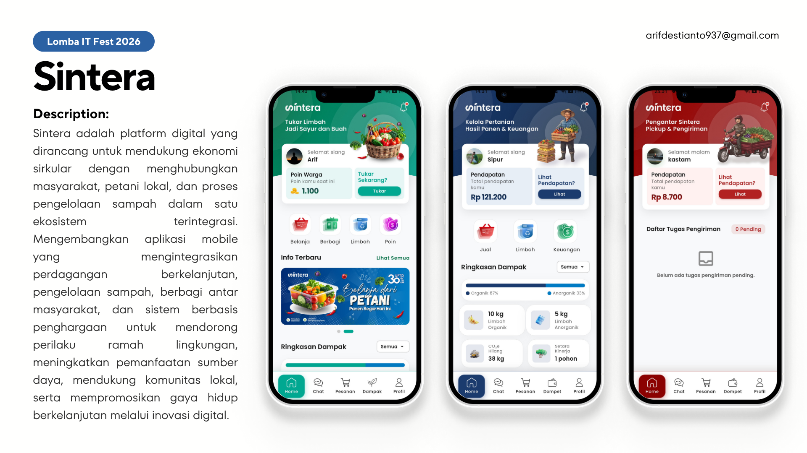
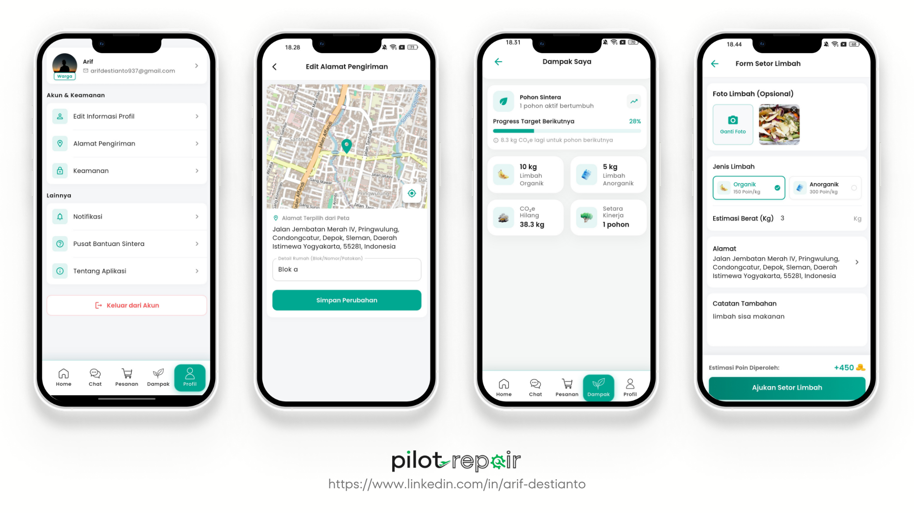
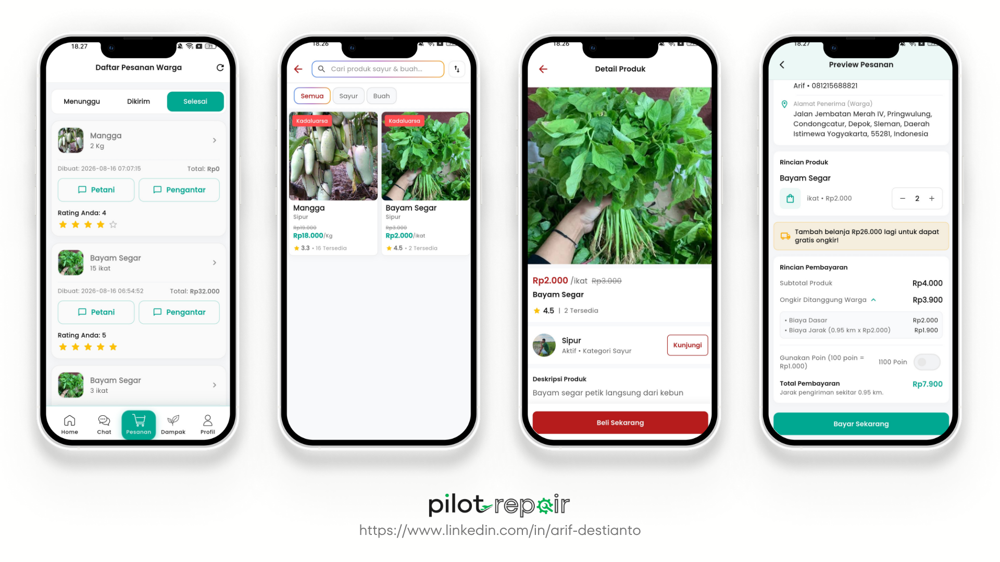
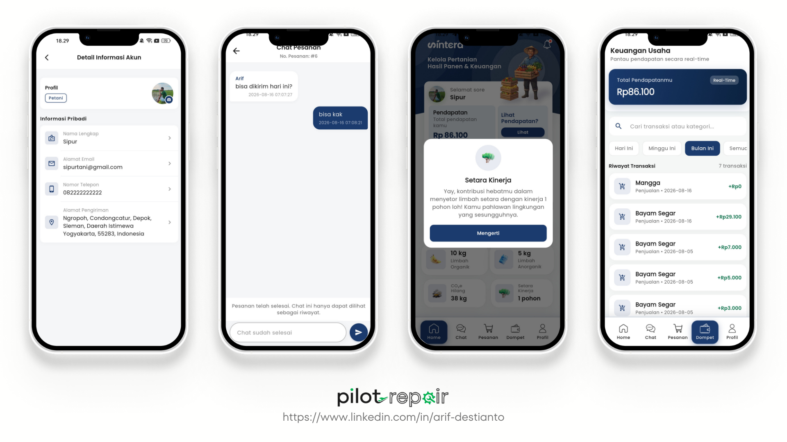
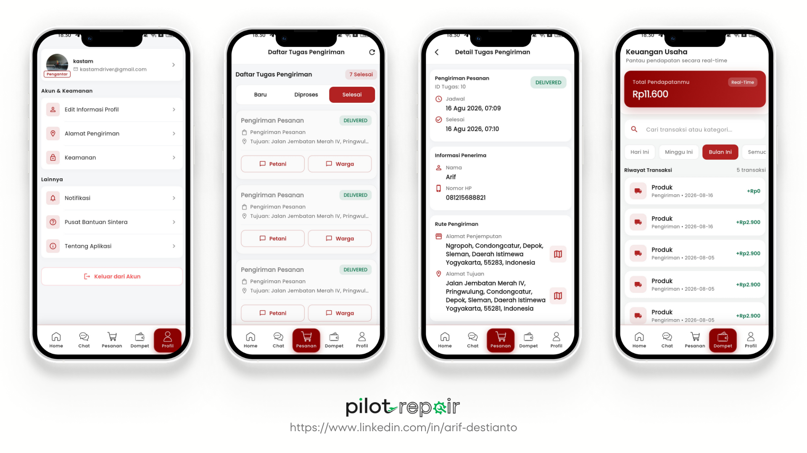

<!-- ================= HEADER ================= -->

<p align="center">
  
</p>

<p align="center">
  
</p>

<p align="center">
  <a href="https://www.arifdestianto.my.id" target="_blank">
    
  </a>

  

  

  
</p>

---

## About the Project

**Sintera** is a digital platform developed for the **ITFest 2026 Competition** under the theme *"Driving Sustainability in Nature Through Digital Innovation."*

The platform is designed to support the **circular economy** by connecting communities, local farmers, sustainable commerce, waste management, and community-based sharing within an integrated digital ecosystem.

Sintera aims to encourage environmentally responsible behavior, optimize resource utilization, support local communities, and promote a more sustainable lifestyle through digital innovation.

---

## Project Preview

<p align="center" style="white-space: nowrap;">

  
  
  
  
  

</p>

---

## Features

### Sustainable Commerce

| Feature | Description |
|---|---|
| Product Discovery | Browse products from local and sustainable sources |
| Product Ordering | Browse products and place orders through the application |
| Sustainable Commerce | Support local farmers and sustainable products |
| Order Management | Manage and track user orders |

---

### Waste Management

| Feature | Description |
|---|---|
| Waste Management | Manage and organize community waste activities |
| Waste Collection | Support community-based waste collection |
| Waste Classification | Organize waste based on its category |
| Community Participation | Encourage users to participate in sustainable activities |

---

### Community & Sharing

| Feature | Description |
|---|---|
| Community Sharing | Enable users to share resources and goods |
| Local Community | Connect users with their surrounding community |
| Resource Utilization | Encourage better utilization of available resources |
| Social Participation | Promote community involvement in sustainability |

---

### Reward System

| Feature | Description |
|---|---|
| Points | Reward users for sustainable activities |
| Activity Rewards | Provide rewards for participating in environmental activities |
| User Incentives | Encourage users to maintain sustainable habits |

---

## Tech Stack

### Frontend & Mobile

<p align="center">
  
</p>

### Backend

<p align="center">
  
  
</p>

### Database

<p align="center">
  
</p>

### Tools & Platforms

<p align="center">
  
  
  
  
  
</p>

---

## Architecture

```text
┌──────────────────────────────┐
│       Flutter Mobile App     │
│            Sintera            │
└──────────────┬───────────────┘
               │
               │ REST API
               ▼
┌──────────────────────────────┐
│          Laravel API         │
│           Backend            │
└──────────────┬───────────────┘
               │
               ▼
┌──────────────────────────────┐
│          PostgreSQL          │
│           Database           │
└──────────────────────────────┘
